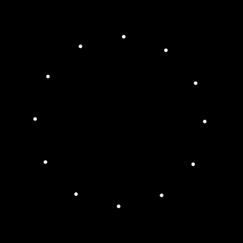
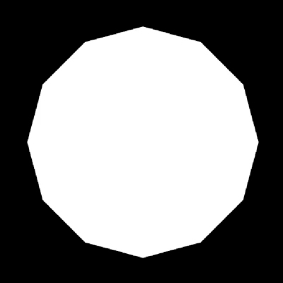
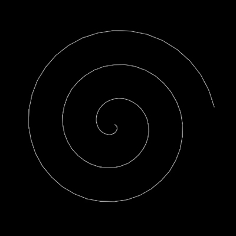
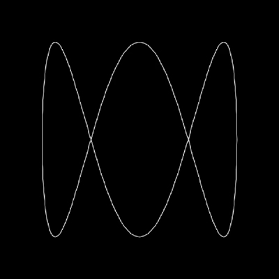
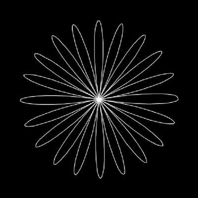

# estudos-processing-generative-art
Estudos iniciais em arte generativa com o Processing 3.

Sinta-se livre para copiar e modificar.

#Trabalho em andamento#

## Prints
##### Estudo001

##### Estudo002

##### Estudo003

##### Estudo004

##### Estudo005

## Referências
1: [Implement Polar Coordinates by p5.js](https://www.youtube.com/watch?v=sncVcmV6bI8)

2: [Implement Spherical Coordinates by p5.js](https://www.youtube.com/watch?v=SGHWZz5Mrsw) 

## Author
José Luís Haas

Follow me on Instagram [@zeco.art](https://instagram.com/zeco.art)
